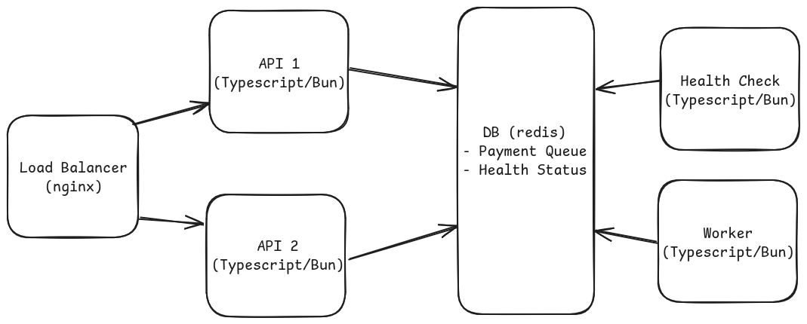

# Rinha de Backend 2025

Submissão para o desafio Rinha de Backend 2025, usando Typescript.

## Tecnologias
- Typescript (Bun)
- Nginx
- Redis
- Docker

## Arquitetura

O load balancer direciona as requisições de pagamentos para as duas instâncias
de API, que adicionam essas requisições a uma fila no banco de dados Redis.
Um worker processa de forma assíncrona a fila de pagamentos, utilizando as
informações sobre o status dos serviços externos de processamento salvas
no banco pelo Health Check a cada 5 segundos.
